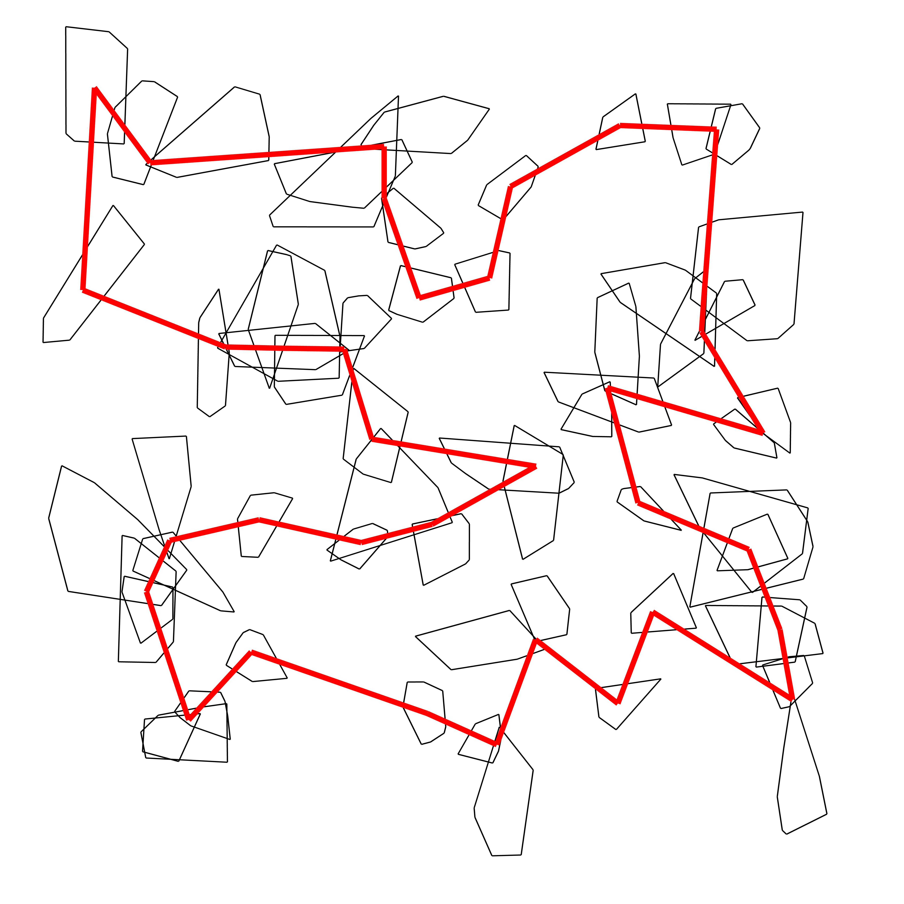
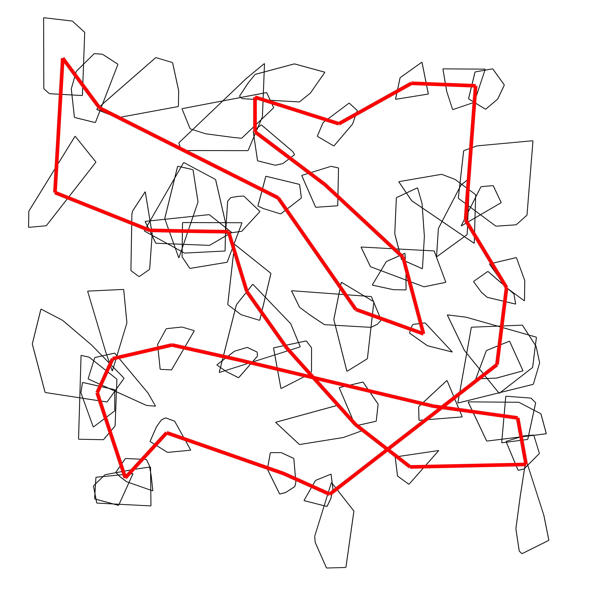
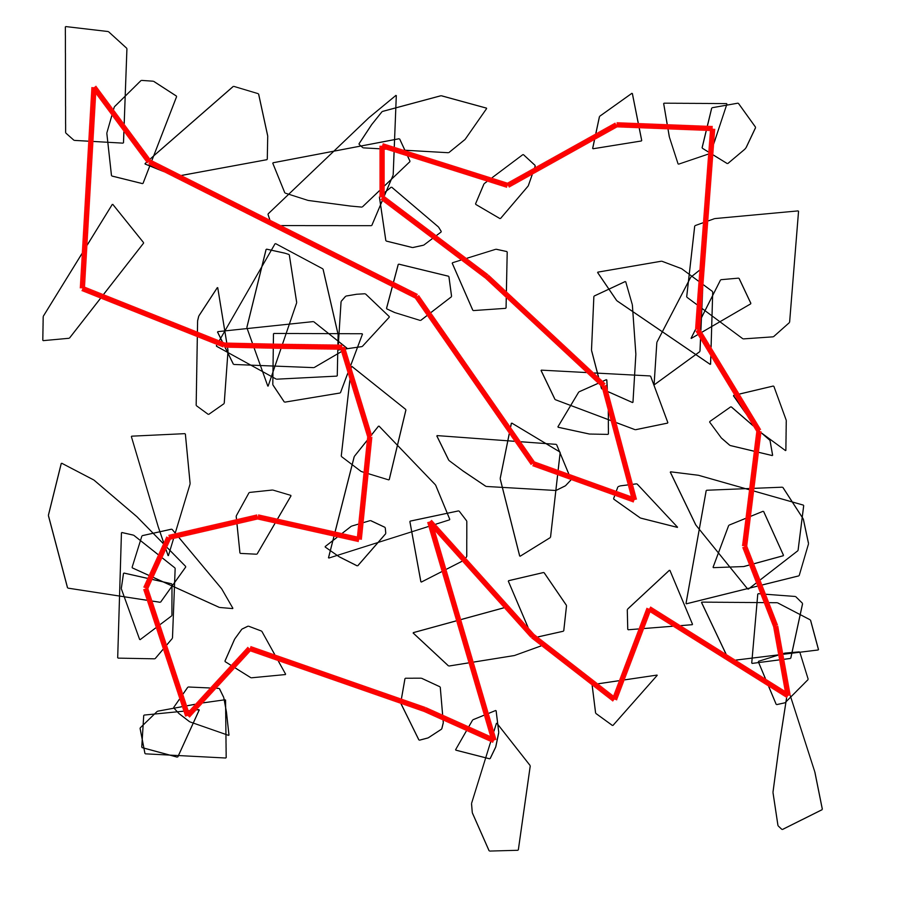
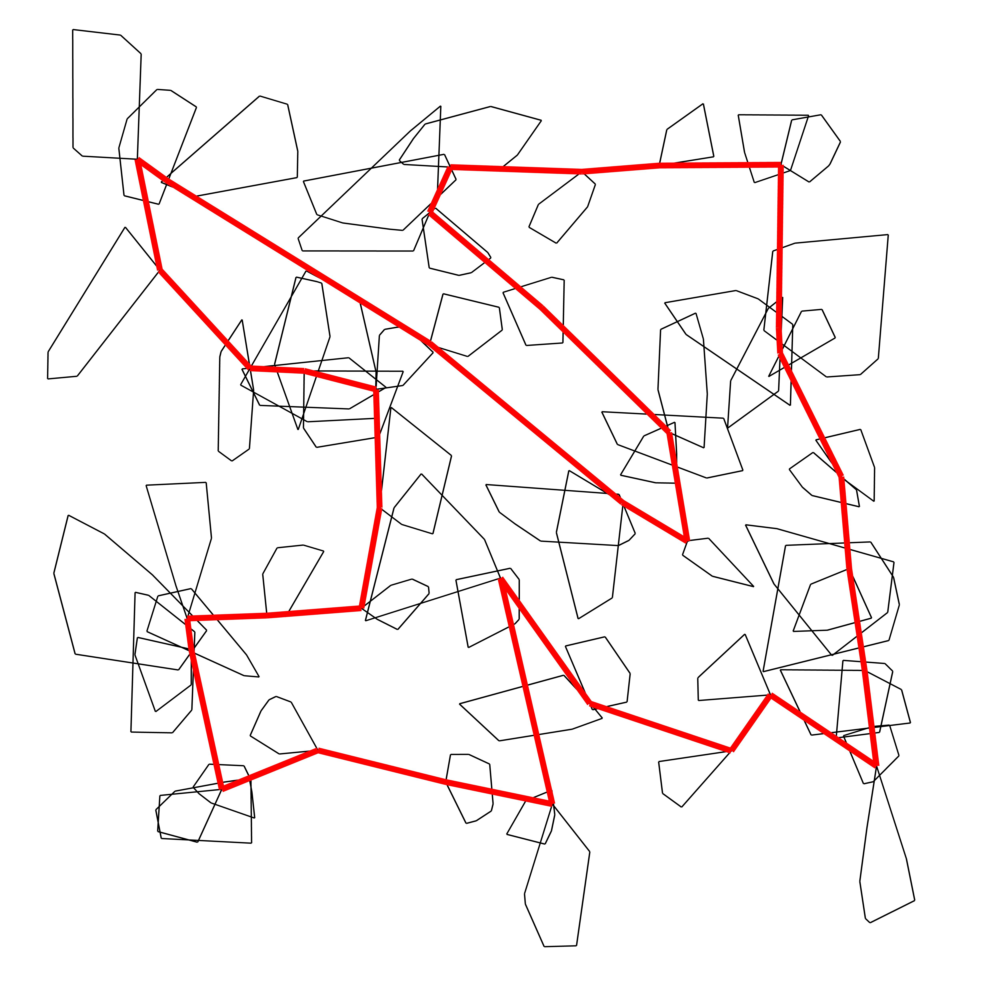
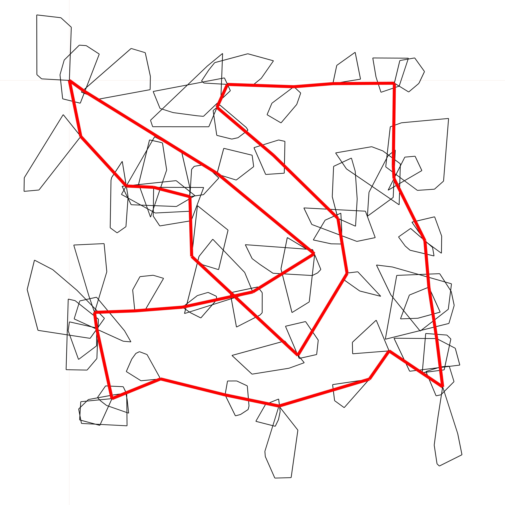
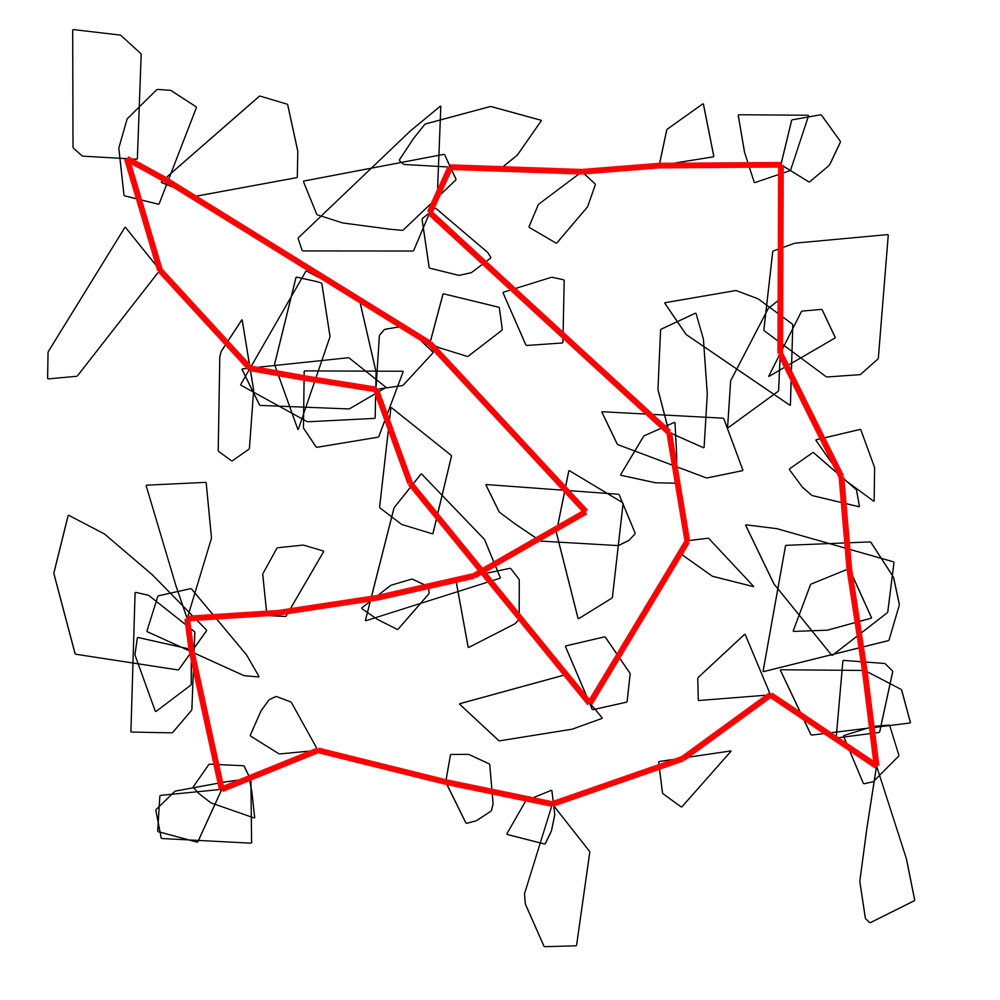
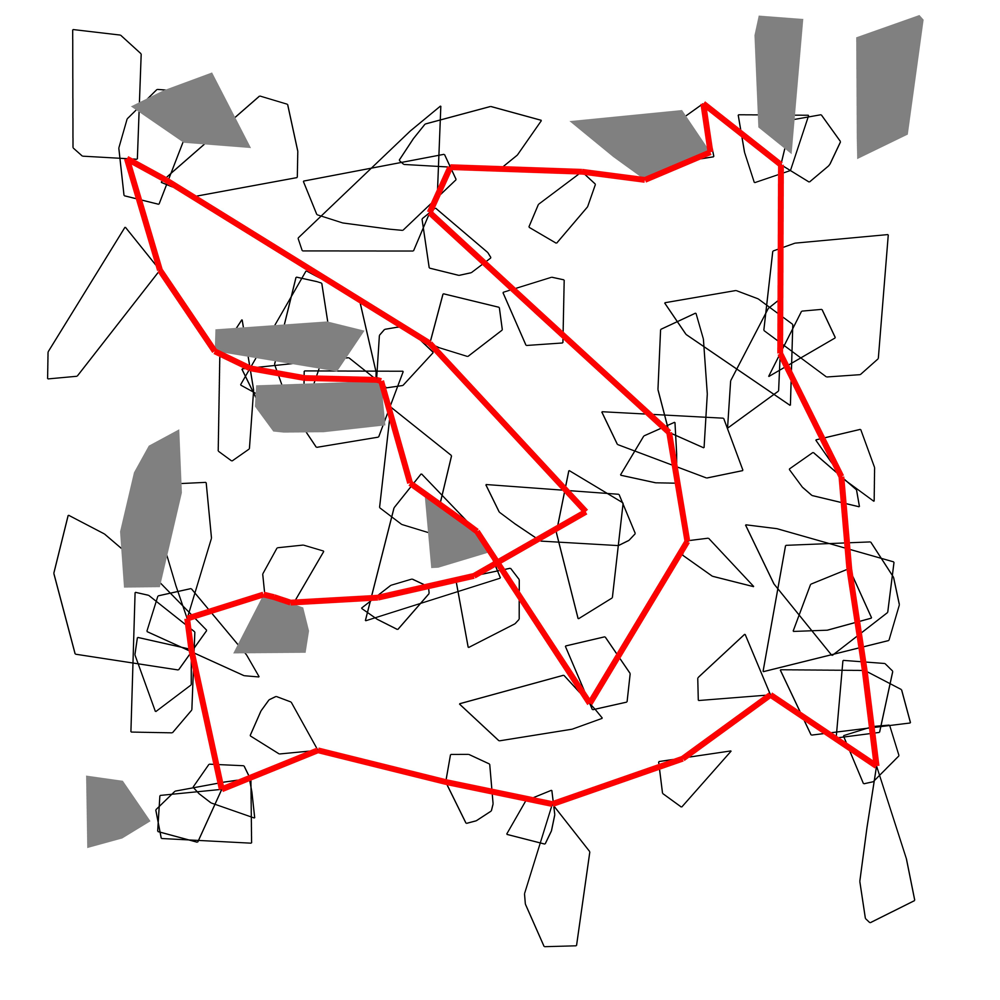
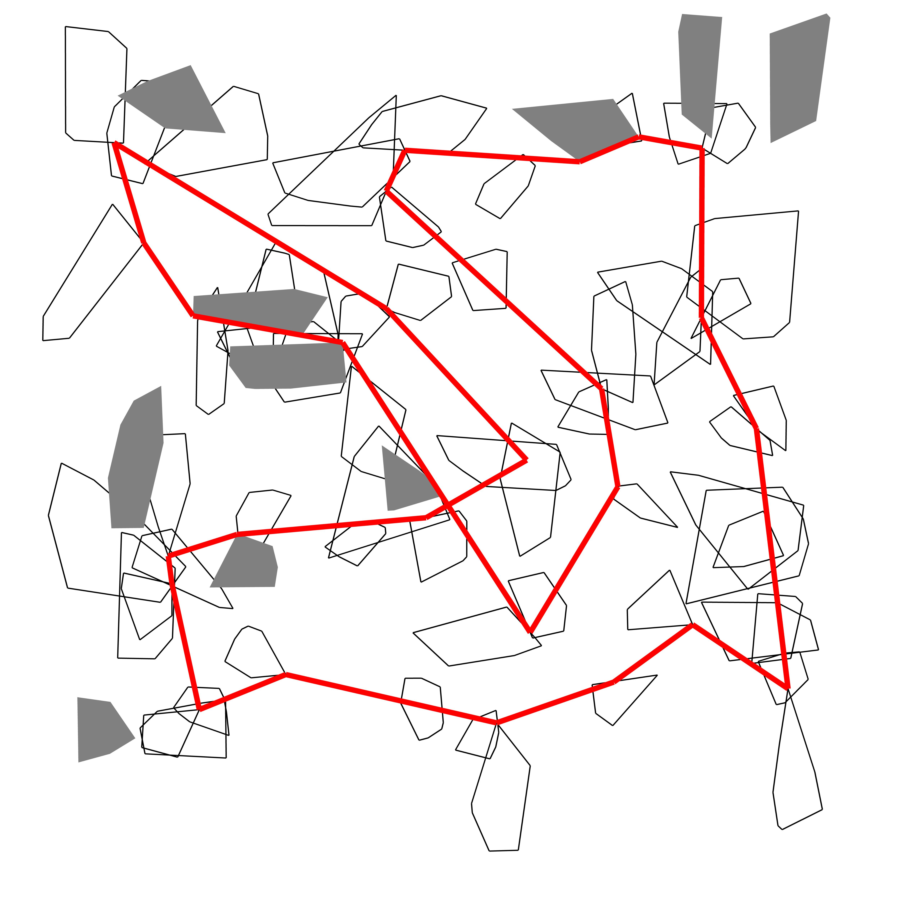

# Teamprojekt

## Inhalt
Dieses Teamprojekt beinhaltet einen Algorithmus für das Close-Enough
Area Travelling Salesman Problem inklusive Turn-Costs. Der Algorithmus erhält
eine Menge an Flächen und muss in möglichst kurzer Zeit eine möglichst kurze
Rundreise finden, die alle Flächen besucht und dabei möglichst kleine
Abbiegewinkel nutzt.

## Installation
Alle benötigten Pakete sind in der requirements.txt definiert. Diese können mit
`pip install -r requirements.txt` genutzt werden

Das Programm kann standardmäßig mit `python3 src/main.py` gestartet werden. Dann
werden eine JPG-Datei mit den Koordinaten und eine CSV-Datei mit den Koordinaten
erstellt. Mit `python3 main.py -h` kann eine Hilfe für die möglichen Argumente
angezeigt werden.

## Solver Ablauf
Eine beispielhafte Instanz, wo jede Fläche durchlaufen werden muss und die grauen Flächen nicht durchkreuzt werden dürfen.

